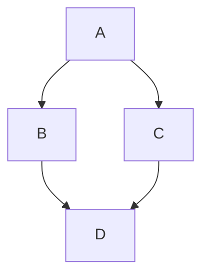

# README for DEBCF: Dynamic Event Booting &amp; Configuration Framework

> [!NOTE]
> This is a **Markdown** file and is formatted for viewing in $$\textcolor{Gold}{Github}$$ only. VS Code Markdown Viewer Extensions gives some errors.
> 
> You can read the [Markdown Wiki](#markdown-wiki) to learn how to use and modify these types of files.
> 
>This Documentation is for $$\textcolor{aqua}{Stellaris}$$ game, $$\textcolor{gold}{DEBCF: \space Dynamic \space Event \space Booting \space \\& \space Configuration \space Framework}$$ mod.
<!--Horizontal Line-->
---


# Markdown Wiki

## Text Color Changing in Github

> [!TIP]
> Normally Github doesn't permit Text Color changes in README files. We use a workaround by using Inline Coding from $$\textcolor{gold}{LATEX}$$ programming language.

> [!WARNING]
> Viewing Color Text Codes in VSCode gives some formatting errors. View them in Github.

You can change Text Color in anywhere in your Markdown files. Even titles.

You can use either ```\textcolor```, or ```\color``` codes to do the job. ```\textcolor``` only impacts the Text, while ```\color``` is applied to text, all math symbols, and equations.

- The correct Syntax is `{\color{color-name}<text or equation>}` wrapped in `$$`
- Each `\color{color-name}` should be under separate one open `{` and one closed `}` curly bracket.
- While using multiple words etc, you need to use `\space` function to leave spaces between words.
- To use Special Characters, you need to escape them via `\\`. e.g. `\\&` >> & (Using only one `\` sometimes isn't enough. $$\textcolor{red}{WARNING:}$$ VS Code might give errors.)
- To prevent the Text from appearing in Middle of Screen, you should use a `&nbsp;` to leave a Space that $$\textcolor{gold}{LATEX}$$ can't ignore.

### Usage

&nbsp; | Code | Result
:---------| ----- | ----- |
Single Word, Single Color, No Special Characters | `$$\textcolor{aqua}{Example}$$` | $$\textcolor{aqua}{Example}$$ |
Single Word, Single Color, Special Characters | `$$\textcolor{aqua}{\\&}$$` | $$\textcolor{aqua}{\\&}$$ |
Single Word, Multi Color | `$$\textcolor{aqua}{E}\textcolor{red}{X}\textcolor{yellow}{A}\textcolor{green}{M}\textcolor{white}{P}\textcolor{blue}{L}\textcolor{purple}{E}$$` | $$\textcolor{aqua}{E}\textcolor{red}{X}\textcolor{yellow}{A}\textcolor{green}{M}\textcolor{white}{P}\textcolor{blue}{L}\textcolor{purple}{E}$$
Multi Word | `$$\textcolor{aqua}{Example \space With \space Space}$$` | $$\textcolor{aqua}{Example \space With \space Space}$$
Multi Word, Multi Color | `$$\textcolor{aqua}{Example} \space \textcolor{red}{With} \space \textcolor{green}{Space}$$` | $$\textcolor{aqua}{Example} \space \textcolor{red}{With} \space \textcolor{green}{Space}$$

### Color Codes for $$\textcolor{gold}{LATEX}$$ programming language

Color | Color Code |
:---------| ----- |
aqua | $$\textcolor{aqua}{Color Example}$$
black | $$\textcolor{black}{Color Example}$$
blue | $$\textcolor{blue}{Color Example}$$
brown | $$\textcolor{brown}{Color Example}$$
cyan | $$\textcolor{cyan}{Color Example}$$
darkgray | $$\textcolor{darkgray}{Color Example}$$
gold | $$\textcolor{gold}{Color Example}$$
gray | $$\textcolor{gray}{Color Example}$$
green | $$\textcolor{green}{Color Example}$$
lightblue | $$\textcolor{lightblue}{Color Example}$$
lightgray | $$\textcolor{lightgray}{Color Example}$$
lightgreen | $$\textcolor{lightgreen}{Color Example}$$
magenta | $$\textcolor{magenta}{Color Example}$$
orange | $$\textcolor{orange}{Color Example}$$
pink | $$\textcolor{pink}{Color Example}$$
purple | $$\textcolor{purple}{Color Example}$$
red | $$\textcolor{red}{Color Example}$$
violet | $$\textcolor{violet}{Color Example}$$
white | $$\textcolor{white}{Color Example}$$
yellow | $$\textcolor{yellow}{Color Example}$$

## About the repository README file

You can add a README file to your repository to tell other people why your project is useful, what they can do with your project, and how they can use it.

### About READMEs

You can add a README file to a repository to communicate important information about your project. A README, along with a repository license, citation file, contribution guidelines, and a code of conduct, communicates expectations for your project and helps you manage contributions.

For more information about providing guidelines for your project, see [Adding a code of conduct to your project](https://docs.github.com/en/communities/setting-up-your-project-for-healthy-contributions/adding-a-code-of-conduct-to-your-project) and [Setting up your project for healthy contributions](https://docs.github.com/en/communities/setting-up-your-project-for-healthy-contributions).

A README is often the first item a visitor will see when visiting your repository. README files typically include information on:

* What the project does
* Why the project is useful
* How users can get started with the project
* Where users can get help with your project
* Who maintains and contributes to the project

If you put your README file in your repository's hidden `.github`, root, or `docs` directory, GitHub will recognize and automatically surface your README to repository visitors.

If a repository contains more than one README file, then the file shown is chosen from locations in the following order: the `.github` directory, then the repository's root directory, and finally the `docs` directory.

When your README is viewed on GitHub, any content beyond 500 KiB will be truncated.

If you add a README file to the root of a public repository with the same name as your username, that README will automatically appear on your profile page. You can edit your profile README with GitHub Flavored Markdown to create a personalized section on your profile. For more information, see [Managing your profile README](https://docs.github.com/en/account-and-profile/setting-up-and-managing-your-github-profile/customizing-your-profile/managing-your-profile-readme).

### Auto-generated table of contents for markdown files

For the rendered view of any Markdown file in a repository, including README files, GitHub will automatically generate a table of contents based on section headings. You can view the table of contents for a README file by clicking the "Outline" menu icon <svg version="1.1" width="16" height="16" viewBox="0 0 16 16" class="octicon octicon-list-unordered" aria-label="Table of Contents" role="img"><path d="M5.75 2.5h8.5a.75.75 0 0 1 0 1.5h-8.5a.75.75 0 0 1 0-1.5Zm0 5h8.5a.75.75 0 0 1 0 1.5h-8.5a.75.75 0 0 1 0-1.5Zm0 5h8.5a.75.75 0 0 1 0 1.5h-8.5a.75.75 0 0 1 0-1.5ZM2 14a1 1 0 1 1 0-2 1 1 0 0 1 0 2Zm1-6a1 1 0 1 1-2 0 1 1 0 0 1 2 0ZM2 4a1 1 0 1 1 0-2 1 1 0 0 1 0 2Z"></path></svg> in the top corner of the rendered page.

### Section links in markdown files and blob pages

You can link directly to any section that has a heading. To view the automatically generated anchor in a rendered file, hover over the section heading to expose the <svg version="1.1" width="16" height="16" viewBox="0 0 16 16" class="octicon octicon-link" aria-label="the link" role="img"><path d="m7.775 3.275 1.25-1.25a3.5 3.5 0 1 1 4.95 4.95l-2.5 2.5a3.5 3.5 0 0 1-4.95 0 .751.751 0 0 1 .018-1.042.751.751 0 0 1 1.042-.018 1.998 1.998 0 0 0 2.83 0l2.5-2.5a2.002 2.002 0 0 0-2.83-2.83l-1.25 1.25a.751.751 0 0 1-1.042-.018.751.751 0 0 1-.018-1.042Zm-4.69 9.64a1.998 1.998 0 0 0 2.83 0l1.25-1.25a.751.751 0 0 1 1.042.018.751.751 0 0 1 .018 1.042l-1.25 1.25a3.5 3.5 0 1 1-4.95-4.95l2.5-2.5a3.5 3.5 0 0 1 4.95 0 .751.751 0 0 1-.018 1.042.751.751 0 0 1-1.042.018 1.998 1.998 0 0 0-2.83 0l-2.5 2.5a1.998 1.998 0 0 0 0 2.83Z"></path></svg> icon and click the icon to display the anchor in your browser.


For more detailed information about section links, see [Section links](#section-links).

### Relative links and image paths in markdown files

You can define relative links and image paths in your rendered files to help readers navigate to other files in your repository.

A relative link is a link that is relative to the current file. For example, if you have a README file in root of your repository, and you have another file in *docs/CONTRIBUTING.md*, the relative link to *CONTRIBUTING.md* in your README might look like this:

```text
[Contribution guidelines for this project](docs/CONTRIBUTING.md)
```

GitHub will automatically transform your relative link or image path based on whatever branch you're currently on, so that the link or path always works. The path of the link will be relative to the current file. Links starting with `/` will be relative to the repository root. You can use all relative link operands, such as `./` and `../`.

Your link text should be on a single line. The example below will not work.

```markdown
[Contribution
guidelines for this project](docs/CONTRIBUTING.md)
```

Relative links are easier for users who clone your repository. Absolute links may not work in clones of your repository - we recommend using relative links to refer to other files within your repository.

### Wikis

A README should only contain information necessary for developers to get started using and contributing to your project. Longer documentation is best suited for wikis. For more information, see [About wikis](https://docs.github.com/en/communities/documenting-your-project-with-wikis/about-wikis).

### Further reading

* [Adding a file to a repository](https://docs.github.com/en/repositories/working-with-files/managing-files/adding-a-file-to-a-repository)
* [5 tips for making your GitHub profile page accessible](https://github.blog/2023-10-26-5-tips-for-making-your-github-profile-page-accessible/) in the GitHub blog
* [Facilitating quick creation and resumption of codespaces](https://docs.github.com/en/codespaces/setting-up-your-project-for-codespaces/setting-up-your-repository/adding-a-codespaces-badge)

## Basic writing and formatting syntax in Github

> [!TIP]
> This is imported from https://docs.github.com/en/get-started/writing-on-github/getting-started-with-writing-and-formatting-on-github/basic-writing-and-formatting-syntax

Create sophisticated formatting for your prose and code on GitHub with simple syntax.

### Headings

To create a heading, add one to six <kbd>#</kbd> symbols before your heading text. The number of <kbd>#</kbd> you use will determine the hierarchy level and typeface size of the heading.

```markdown
# A first-level heading
## A second-level heading
### A third-level heading
```


When you use two or more headings, GitHub automatically generates a table of contents that you can access by clicking the "Outline" menu icon <svg version="1.1" width="16" height="16" viewBox="0 0 16 16" class="octicon octicon-list-unordered" aria-label="Table of Contents" role="img"><path d="M5.75 2.5h8.5a.75.75 0 0 1 0 1.5h-8.5a.75.75 0 0 1 0-1.5Zm0 5h8.5a.75.75 0 0 1 0 1.5h-8.5a.75.75 0 0 1 0-1.5Zm0 5h8.5a.75.75 0 0 1 0 1.5h-8.5a.75.75 0 0 1 0-1.5ZM2 14a1 1 0 1 1 0-2 1 1 0 0 1 0 2Zm1-6a1 1 0 1 1-2 0 1 1 0 0 1 2 0ZM2 4a1 1 0 1 1 0-2 1 1 0 0 1 0 2Z"></path></svg> within the file header. Each heading title is listed in the table of contents and you can click a title to navigate to the selected section.


### Styling text

You can indicate emphasis with bold, italic, strikethrough, subscript, or superscript text in comment fields and `.md` files.

| Style                  | Syntax              | Keyboard shortcut                                                                     | Example                                  | Output                                 |                                                   |
| ---------------------- | ------------------- | ------------------------------------------------------------------------------------- | ---------------------------------------- | -------------------------------------- | ------------------------------------------------- |
| Bold                   | `** **` or `__ __`  | <kbd>Command</kbd>+<kbd>B</kbd> (Mac) or <kbd>Ctrl</kbd>+<kbd>B</kbd> (Windows/Linux) | `**This is bold text**`                  | **This is bold text**                  |                                                   |
| Italic                 | `* *` or `_ _`      | <kbd>Command</kbd>+<kbd>I</kbd> (Mac) or <kbd>Ctrl</kbd>+<kbd>I</kbd> (Windows/Linux) | `_This text is italicized_`              | *This text is italicized*              |                                                   |
| Strikethrough          | `~~ ~~` or `~ ~`    | None                                                                                  | `~~This was mistaken text~~`             | ~~This was mistaken text~~             |                                                   |
| Bold and nested italic | `** **` and `_ _`   | None                                                                                  | `**This text is _extremely_ important**` | **This text is *extremely* important** |                                                   |
| All bold and italic    | `*** ***`           | None                                                                                  | `***All this text is important***`       | ***All this text is important***       | <!-- markdownlint-disable-line emphasis-style --> |
| Subscript              | `<sub> </sub>`      | None                                                                                  | `This is a <sub>subscript</sub> text`    | This is a <sub>subscript</sub> text    |                                                   |
| Superscript            | `<sup> </sup>`      | None                                                                                  | `This is a <sup>superscript</sup> text`  | This is a <sup>superscript</sup> text  |                                                   |
| Underline              | `<ins> </ins>`      | None                                                                                  | `This is an <ins>underlined</ins> text`  | This is an <ins>underlined</ins> text  |                                                   |

### Quoting text

You can quote text with a <kbd>></kbd>.

```markdown
Text that is not a quote

> Text that is a quote
```

Quoted text is indented with a vertical line on the left and displayed using gray type.


> [!NOTE]
> When viewing a conversation, you can automatically quote text in a comment by highlighting the text, then typing <kbd>R</kbd>. You can quote an entire comment by clicking <svg version="1.1" width="16" height="16" viewBox="0 0 16 16" class="octicon octicon-kebab-horizontal" aria-label="The horizontal kebab icon" role="img"><path d="M8 9a1.5 1.5 0 1 0 0-3 1.5 1.5 0 0 0 0 3ZM1.5 9a1.5 1.5 0 1 0 0-3 1.5 1.5 0 0 0 0 3Zm13 0a1.5 1.5 0 1 0 0-3 1.5 1.5 0 0 0 0 3Z"></path></svg>, then **Quote reply**. For more information about keyboard shortcuts, see [Keyboard shortcuts](https://docs.github.com/en/get-started/accessibility/keyboard-shortcuts).

### Quoting code

You can call out code or a command within a sentence with single backticks. The text within the backticks will not be formatted. You can also press the <kbd>Command</kbd>+<kbd>E</kbd> (Mac) or <kbd>Ctrl</kbd>+<kbd>E</kbd> (Windows/Linux) keyboard shortcut to insert the backticks for a code block within a line of Markdown.

```markdown
Use `git status` to list all new or modified files that haven't yet been committed.
```


To format code or text into its own distinct block, use triple backticks.

````markdown
Some basic Git commands are:
```
git status
git add
git commit
```
````


For more information, see [Creating and highlighting code blocks](#creating-and-highlighting-code-blocks).

If you are frequently editing code snippets and tables, you may benefit from enabling a fixed-width font in all comment fields on GitHub. For more information, see [About writing and formatting on GitHub](https://docs.github.com/en/get-started/writing-on-github/getting-started-with-writing-and-formatting-on-github/about-writing-and-formatting-on-github#enabling-fixed-width-fonts-in-the-editor).

### Supported color models

In issues, pull requests, and discussions, you can call out colors within a sentence by using backticks. A supported color model within backticks will display a visualization of the color.

```markdown
The background color is `#ffffff` for light mode and `#000000` for dark mode.
```


Here are the currently supported color models.

| Color | Syntax                      | Example                             | Output                                                                                                                                                                         |
| ----- | --------------------------- | ----------------------------------- | ------------------------------------------------------------------------------------------------------------------------------------------------------------------------------ |
| HEX   | <code>\`#RRGGBB\`</code>    | <code>\`#0969DA\`</code>            |        |
| RGB   | <code>\`rgb(R,G,B)\`</code> | <code>\`rgb(9, 105, 218)\`</code>   |    |
| HSL   | <code>\`hsl(H,S,L)\`</code> | <code>\`hsl(212, 92%, 45%)\`</code> |  |

> [!NOTE]
>
> * A supported color model cannot have any leading or trailing spaces within the backticks.
> * The visualization of the color is only supported in issues, pull requests, and discussions.

### Links

You can create an inline link by wrapping link text in brackets `[ ]`, and then wrapping the URL in parentheses `( )`. You can also use the keyboard shortcut <kbd>Command</kbd>+<kbd>K</kbd> to create a link. When you have text selected, you can paste a URL from your clipboard to automatically create a link from the selection.

You can also create a Markdown hyperlink by highlighting the text and using the keyboard shortcut <kbd>Command</kbd>+<kbd>V</kbd>. If you'd like to replace the text with the link, use the keyboard shortcut <kbd>Command</kbd>+<kbd>Shift</kbd>+<kbd>V</kbd>.

`This site was built using [GitHub Pages](https://pages.github.com/).`


> [!NOTE]
> GitHub automatically creates links when valid URLs are written in a comment. For more information, see [Autolinked references and URLs](#autolinked-references-and-urls).

### Section links

You can link directly to any section that has a heading. To view the automatically generated anchor in a rendered file, hover over the section heading to expose the <svg version="1.1" width="16" height="16" viewBox="0 0 16 16" class="octicon octicon-link" aria-label="the link" role="img"><path d="m7.775 3.275 1.25-1.25a3.5 3.5 0 1 1 4.95 4.95l-2.5 2.5a3.5 3.5 0 0 1-4.95 0 .751.751 0 0 1 .018-1.042.751.751 0 0 1 1.042-.018 1.998 1.998 0 0 0 2.83 0l2.5-2.5a2.002 2.002 0 0 0-2.83-2.83l-1.25 1.25a.751.751 0 0 1-1.042-.018.751.751 0 0 1-.018-1.042Zm-4.69 9.64a1.998 1.998 0 0 0 2.83 0l1.25-1.25a.751.751 0 0 1 1.042.018.751.751 0 0 1 .018 1.042l-1.25 1.25a3.5 3.5 0 1 1-4.95-4.95l2.5-2.5a3.5 3.5 0 0 1 4.95 0 .751.751 0 0 1-.018 1.042.751.751 0 0 1-1.042.018 1.998 1.998 0 0 0-2.83 0l-2.5 2.5a1.998 1.998 0 0 0 0 2.83Z"></path></svg> icon and click the icon to display the anchor in your browser.


If you need to determine the anchor for a heading in a file you are editing, you can use the following basic rules:

* Letters are converted to lower-case.
* Spaces are replaced by hyphens (`-`). Any other whitespace or punctuation characters are removed.
* Leading and trailing whitespace are removed.
* Markup formatting is removed, leaving only the contents (for example, `_italics_` becomes `italics`).
* If the automatically generated anchor for a heading is identical to an earlier anchor in the same document, a unique identifier is generated by appending a hyphen and an auto-incrementing integer.

For more detailed information on the requirements of URI fragments, see [RFC 3986: Uniform Resource Identifier (URI): Generic Syntax, Section 3.5](https://www.rfc-editor.org/rfc/rfc3986#section-3.5).

The code block below demonstrates the basic rules used to generate anchors from headings in rendered content.

```markdown
# Example headings

## Sample Section

## This'll be a _Helpful_ Section About the Greek Letter Θ!
A heading containing characters not allowed in fragments, UTF-8 characters, two consecutive spaces between the first and second words, and formatting.

## This heading is not unique in the file

TEXT 1

## This heading is not unique in the file

TEXT 2

# Links to the example headings above

Link to the sample section: [Link Text](#sample-section).

Link to the helpful section: [Link Text](#thisll-be-a-helpful-section-about-the-greek-letter-Θ).

Link to the first non-unique section: [Link Text](#this-heading-is-not-unique-in-the-file).

Link to the second non-unique section: [Link Text](#this-heading-is-not-unique-in-the-file-1).
```

> [!NOTE]
> If you edit a heading, or if you change the order of headings with "identical" anchors, you will also need to update any links to those headings as the anchors will change.

### Relative links

You can define relative links and image paths in your rendered files to help readers navigate to other files in your repository.

A relative link is a link that is relative to the current file. For example, if you have a README file in root of your repository, and you have another file in *docs/CONTRIBUTING.md*, the relative link to *CONTRIBUTING.md* in your README might look like this:

```text
[Contribution guidelines for this project](docs/CONTRIBUTING.md)
```

GitHub will automatically transform your relative link or image path based on whatever branch you're currently on, so that the link or path always works. The path of the link will be relative to the current file. Links starting with `/` will be relative to the repository root. You can use all relative link operands, such as `./` and `../`.

Your link text should be on a single line. The example below will not work.

```markdown
[Contribution
guidelines for this project](docs/CONTRIBUTING.md)
```

Relative links are easier for users who clone your repository. Absolute links may not work in clones of your repository - we recommend using relative links to refer to other files within your repository.

### Custom anchors

You can use standard HTML anchor tags (`<a name="unique-anchor-name"></a>`) to create navigation anchor points for any location in the document. To avoid ambiguous references, use a unique naming scheme for anchor tags, such as adding a prefix to the `name` attribute value.

> [!NOTE]
> Custom anchors will not be included in the document outline/Table of Contents.

You can link to a custom anchor using the value of the `name` attribute you gave the anchor. The syntax is exactly the same as when you link to an anchor that is automatically generated for a heading.

For example:

```markdown
# Section Heading

Some body text of this section.

<a name="my-custom-anchor-point"></a>
Some text I want to provide a direct link to, but which doesn't have its own heading.

(… more content…)

[A link to that custom anchor](#my-custom-anchor-point)
```

> [!TIP]
> Custom anchors are not considered by the automatic naming and numbering behavior of automatic heading links.

### Line breaks

If you're writing in issues, pull requests, or discussions in a repository, GitHub will render a line break automatically:

```markdown
This example
Will span two lines
```

However, if you are writing in an .md file, the example above would render on one line without a line break. To create a line break in an .md file, you will need to include one of the following:

* Include two spaces at the end of the first line.
  <pre>
  This example&nbsp;&nbsp;
  Will span two lines
  </pre>

* Include a backslash at the end of the first line.

  ```markdown
  This example\
  Will span two lines
  ```

* Include an HTML single line break tag at the end of the first line.

  ```markdown
  This example<br/>
  Will span two lines
  ```

If you leave a blank line between two lines, both .md files and Markdown in issues, pull requests, and discussions will render the two lines separated by the blank line:

```markdown
This example

Will have a blank line separating both lines
```

### Images

You can display an image by adding <kbd>!</kbd> and wrapping the alt text in `[ ]`. Alt text is a short text equivalent of the information in the image. Then, wrap the link for the image in parentheses `()`.

``


GitHub supports embedding images into your issues, pull requests, discussions, comments and `.md` files. You can display an image from your repository, add a link to an online image, or upload an image. For more information, see [Uploading assets](#uploading-assets).

> [!NOTE]
> When you want to display an image that is in your repository, use relative links instead of absolute links.

Here are some examples for using relative links to display an image.

| Context                                                     | Relative Link                                                          |
| ----------------------------------------------------------- | ---------------------------------------------------------------------- |
| In a `.md` file on the same branch                          | `/assets/images/electrocat.png`                                        |
| In a `.md` file on another branch                           | `/../main/assets/images/electrocat.png`                                |
| In issues, pull requests and comments of the repository     | `../blob/main/assets/images/electrocat.png?raw=true`                   |
| In a `.md` file in another repository                       | `/../../../../github/docs/blob/main/assets/images/electrocat.png`      |
| In issues, pull requests and comments of another repository | `../../../github/docs/blob/main/assets/images/electrocat.png?raw=true` |

> [!NOTE]
> The last two relative links in the table above will work for images in a private repository only if the viewer has at least read access to the private repository that contains these images.

For more information, see [Relative Links](#relative-links).

#### The Picture element

The `<picture>` HTML element is supported.

### Lists

You can make an unordered list by preceding one or more lines of text with <kbd>-</kbd>, <kbd>\*</kbd>, or <kbd>+</kbd>.

```markdown
- George Washington
* John Adams
+ Thomas Jefferson
```


To order your list, precede each line with a number.

```markdown
1. James Madison
2. James Monroe
3. John Quincy Adams
```


#### Nested Lists

You can create a nested list by indenting one or more list items below another item.

To create a nested list using the web editor on GitHub or a text editor that uses a monospaced font, like [Visual Studio Code](https://code.visualstudio.com/), you can align your list visually. Type space characters in front of your nested list item until the list marker character (<kbd>-</kbd> or <kbd>\*</kbd>) lies directly below the first character of the text in the item above it.

```markdown
1. First list item
   - First nested list item
     - Second nested list item
```

> [!NOTE]
> In the web-based editor, you can indent or dedent one or more lines of text by first highlighting the desired lines and then using <kbd>Tab</kbd> or <kbd>Shift</kbd>+<kbd>Tab</kbd> respectively.


To create a nested list in the comment editor on GitHub, which doesn't use a monospaced font, you can look at the list item immediately above the nested list and count the number of characters that appear before the content of the item. Then type that number of space characters in front of the nested list item.

In this example, you could add a nested list item under the list item `100. First list item` by indenting the nested list item a minimum of five spaces, since there are five characters (`100. `) before `First list item`.

```markdown
100. First list item
     - First nested list item
```


You can create multiple levels of nested lists using the same method. For example, because the first nested list item has seven characters (`␣␣␣␣␣-␣`) before the nested list content `First nested list item`, you would need to indent the second nested list item by at least two more characters (nine spaces minimum).

```markdown
100. First list item
     - First nested list item
       - Second nested list item
```


For more examples, see the [GitHub Flavored Markdown Spec](https://github.github.com/gfm/#example-265).

### Task lists

To create a task list, preface list items with a hyphen and space followed by `[ ]`. To mark a task as complete, use `[x]`.

```markdown
- [x] #739
- [ ] https://github.com/octo-org/octo-repo/issues/740
- [ ] Add delight to the experience when all tasks are complete :tada:
```


If a task list item description begins with a parenthesis, you'll need to escape it with <kbd>\\</kbd>:

`- [ ] \(Optional) Open a followup issue`

For more information, see [About tasklists](#about-tasklists-1).

### Mentioning people and teams

You can mention a person or [team](https://docs.github.com/en/organizations/organizing-members-into-teams) on GitHub by typing <kbd>@</kbd> plus their username or team name. This will trigger a notification and bring their attention to the conversation. People will also receive a notification if you edit a comment to mention their username or team name. For more information about notifications, see [About notifications](https://docs.github.com/en/account-and-profile/managing-subscriptions-and-notifications-on-github/setting-up-notifications/about-notifications).

> [!NOTE]
> A person will only be notified about a mention if the person has read access to the repository and, if the repository is owned by an organization, the person is a member of the organization.

`@github/support What do you think about these updates?`


When you mention a parent team, members of its child teams also receive notifications, simplifying communication with multiple groups of people. For more information, see [About organization teams](https://docs.github.com/en/organizations/organizing-members-into-teams/about-teams).

Typing an <kbd>@</kbd> symbol will bring up a list of people or teams on a project. The list filters as you type, so once you find the name of the person or team you are looking for, you can use the arrow keys to select it and press either tab or enter to complete the name. For teams, enter the @organization/team-name and all members of that team will get subscribed to the conversation.

The autocomplete results are restricted to repository collaborators and any other participants on the thread.

### Referencing issues and pull requests

You can bring up a list of suggested issues and pull requests within the repository by typing <kbd>#</kbd>. Type the issue or pull request number or title to filter the list, and then press either tab or enter to complete the highlighted result.

For more information, see [Autolinked references and URLs](#autolinked-references-and-urls).

### Referencing external resources

If custom autolink references are configured for a repository, then references to external resources, like a JIRA issue or Zendesk ticket, convert into shortened links. To know which autolinks are available in your repository, contact someone with admin permissions to the repository. For more information, see [Configuring autolinks to reference external resources](https://docs.github.com/en/repositories/managing-your-repositorys-settings-and-features/managing-repository-settings/configuring-autolinks-to-reference-external-resources).

### Uploading assets

You can upload assets like images by dragging and dropping, selecting from a file browser, or pasting. You can upload assets to issues, pull requests, comments, and `.md` files in your repository.

### Using emojis

You can add emoji to your writing by typing `:EMOJICODE:`, a colon followed by the name of the emoji.

`@octocat :+1: This PR looks great - it's ready to merge! :shipit:`


Typing <kbd>:</kbd> will bring up a list of suggested emoji. The list will filter as you type, so once you find the emoji you're looking for, press **Tab** or **Enter** to complete the highlighted result.

For a full list of available emoji and codes, see [the Emoji-Cheat-Sheet](https://github.com/ikatyang/emoji-cheat-sheet/blob/github-actions-auto-update/README.md).

### Paragraphs

You can create a new paragraph by leaving a blank line between lines of text.

### Footnotes

You can add footnotes to your content by using this bracket syntax:

```text
Here is a simple footnote[^1].

A footnote can also have multiple lines[^2].

[^1]: My reference.
[^2]: To add line breaks within a footnote, add 2 spaces to the end of a line.  
This is a second line.
```

The footnote will render like this:


> [!NOTE]
> The position of a footnote in your Markdown does not influence where the footnote will be rendered. You can write a footnote right after your reference to the footnote, and the footnote will still render at the bottom of the Markdown. Footnotes are not supported in wikis.

### Alerts

**Alerts**, also sometimes known as **callouts** or **admonitions**, are a Markdown extension based on the blockquote syntax that you can use to emphasize critical information. On GitHub, they are displayed with distinctive colors and icons to indicate the significance of the content.

Use alerts only when they are crucial for user success and limit them to one or two per article to prevent overloading the reader. Additionally, you should avoid placing alerts consecutively. Alerts cannot be nested within other elements.

To add an alert, use a special blockquote line specifying the alert type, followed by the alert information in a standard blockquote. Five types of alerts are available:

```markdown
> [!NOTE]
> Useful information that users should know, even when skimming content.

> [!TIP]
> Helpful advice for doing things better or more easily.

> [!IMPORTANT]
> Key information users need to know to achieve their goal.

> [!WARNING]
> Urgent info that needs immediate user attention to avoid problems.

> [!CAUTION]
> Advises about risks or negative outcomes of certain actions.
```

Here are the rendered alerts:


### Hiding content with comments

You can tell GitHub to hide content from the rendered Markdown by placing the content in an HTML comment.

```text
<!-- This content will not appear in the rendered Markdown -->
```

### Ignoring Markdown formatting

You can tell GitHub to ignore (or escape) Markdown formatting by using <kbd>\\</kbd> before the Markdown character.

`Let's rename \*our-new-project\* to \*our-old-project\*.`


For more information on backslashes, see Daring Fireball's [Markdown Syntax](https://daringfireball.net/projects/markdown/syntax#backslash).

> [!NOTE]
> The Markdown formatting will not be ignored in the title of an issue or a pull request.

### Disabling Markdown rendering

When viewing a Markdown file, you can click **Code** at the top of the file to disable Markdown rendering and view the file's source instead.


Disabling Markdown rendering enables you to use source view features, such as line linking, which is not possible when viewing rendered Markdown files.

### Further reading

* [GitHub Flavored Markdown Spec](https://github.github.com/gfm/)
* [About writing and formatting on GitHub](https://docs.github.com/en/get-started/writing-on-github/getting-started-with-writing-and-formatting-on-github/about-writing-and-formatting-on-github)
* [Working with advanced formatting](#working-with-advanced-formatting-in-github)
* [Quickstart for writing on GitHub](https://docs.github.com/en/get-started/writing-on-github/getting-started-with-writing-and-formatting-on-github/quickstart-for-writing-on-github)

## Working with advanced formatting in Github

> [!TIP]
> This is imported from https://docs.github.com/en/get-started/writing-on-github/working-with-advanced-formatting

Formatting like tables, syntax highlighting, and automatic linking allows you to arrange complex information clearly in your pull requests, issues, and comments.

### Organizing information with tables

You can build tables to organize information in comments, issues, pull requests, and wikis.

#### Creating a table

You can create tables with pipes `|` and hyphens `-`. Hyphens are used to create each column's header, while pipes separate each column. You must include a blank line before your table in order for it to correctly render.

```markdown

| First Header  | Second Header |
| ------------- | ------------- |
| Content Cell  | Content Cell  |
| Content Cell  | Content Cell  |
```


The pipes on either end of the table are optional.

Cells can vary in width and do not need to be perfectly aligned within columns. There must be at least three hyphens in each column of the header row.

```markdown
| Command | Description |
| --- | --- |
| git status | List all new or modified files |
| git diff | Show file differences that haven't been staged |
```


If you are frequently editing code snippets and tables, you may benefit from enabling a fixed-width font in all comment fields on GitHub. For more information, see [About writing and formatting on GitHub](https://docs.github.com/en/get-started/writing-on-github/getting-started-with-writing-and-formatting-on-github/about-writing-and-formatting-on-github#enabling-fixed-width-fonts-in-the-editor).

#### Formatting content within your table

You can use [formatting](#basic-writing-and-formatting-syntax-in-github) such as links, inline code blocks, and text styling within your table:

```markdown
| Command | Description |
| --- | --- |
| `git status` | List all *new or modified* files |
| `git diff` | Show file differences that **haven't been** staged |
```


You can align text to the left, right, or center of a column by including colons `:` to the left, right, or on both sides of the hyphens within the header row.

```markdown
| Left-aligned | Center-aligned | Right-aligned |
| :---         |     :---:      |          ---: |
| git status   | git status     | git status    |
| git diff     | git diff       | git diff      |
```


To include a pipe `|` as content within your cell, use a `\` before the pipe:

```markdown
| Name     | Character |
| ---      | ---       |
| Backtick | `         |
| Pipe     | \|        |
```


#### Further reading

* [GitHub Flavored Markdown Spec](https://github.github.com/gfm/)
* [Basic writing and formatting syntax](#basic-writing-and-formatting-syntax-in-github)

### Organizing information with collapsed sections

You can streamline your Markdown by creating a collapsed section with the `<details>` tag.

#### Creating a collapsed section

You can temporarily obscure sections of your Markdown by creating a collapsed section that the reader can choose to expand. For example, when you want to include technical details in an issue comment that may not be relevant or interesting to every reader, you can put those details in a collapsed section.

Any Markdown within the `<details>` block will be collapsed until the reader clicks <svg version="1.1" width="16" height="16" viewBox="0 0 16 16" class="octicon octicon-triangle-right" aria-label="The right triangle icon" role="img"><path d="m6.427 4.427 3.396 3.396a.25.25 0 0 1 0 .354l-3.396 3.396A.25.25 0 0 1 6 11.396V4.604a.25.25 0 0 1 .427-.177Z"></path></svg> to expand the details.

Within the `<details>` block, use the `<summary>` tag to let readers know what is inside. The label appears to the right of <svg version="1.1" width="16" height="16" viewBox="0 0 16 16" class="octicon octicon-triangle-right" aria-label="The right triangle icon" role="img"><path d="m6.427 4.427 3.396 3.396a.25.25 0 0 1 0 .354l-3.396 3.396A.25.25 0 0 1 6 11.396V4.604a.25.25 0 0 1 .427-.177Z"></path></svg>.

```markdown
<details>

<summary>Tips for collapsed sections</summary>

### You can add a header

You can add text within a collapsed section.

You can add an image or a code block, too.

```ruby
   puts "Hello World"
```

</details>
```

The Markdown inside the `<summary>` label will be collapsed by default:


After a reader clicks <svg version="1.1" width="16" height="16" viewBox="0 0 16 16" class="octicon octicon-triangle-right" aria-label="The right triangle icon" role="img"><path d="m6.427 4.427 3.396 3.396a.25.25 0 0 1 0 .354l-3.396 3.396A.25.25 0 0 1 6 11.396V4.604a.25.25 0 0 1 .427-.177Z"></path></svg>, the details are expanded:


Optionally, to make the section display as open by default, add the `open` attribute to the `<details>` tag:

```html
<details open>
```

#### Further reading

* [GitHub Flavored Markdown Spec](https://github.github.com/gfm/)
* [Basic writing and formatting syntax](#basic-writing-and-formatting-syntax-in-github)

### Creating and highlighting code blocks

Share samples of code with fenced code blocks and enabling syntax highlighting.

#### Fenced code blocks

You can create fenced code blocks by placing triple backticks <code>\`\`\`</code> before and after the code block. We recommend placing a blank line before and after code blocks to make the raw formatting easier to read.

````text
```
function test() {
  console.log("notice the blank line before this function?");
}
```
````


> [!TIP]
> To preserve your formatting within a list, make sure to indent non-fenced code blocks by eight spaces.

To display triple backticks in a fenced code block, wrap them inside quadruple backticks.

`````text
````
```
Look! You can see my backticks.
```
````
`````


If you are frequently editing code snippets and tables, you may benefit from enabling a fixed-width font in all comment fields on GitHub. For more information, see [About writing and formatting on GitHub](https://docs.github.com/en/get-started/writing-on-github/getting-started-with-writing-and-formatting-on-github/about-writing-and-formatting-on-github#enabling-fixed-width-fonts-in-the-editor).

#### Syntax highlighting

<!-- If you make changes to this feature, check whether any of the changes affect languages listed in /get-started/learning-about-github/github-language-support. If so, please update the language support article accordingly. -->

You can add an optional language identifier to enable syntax highlighting in your fenced code block.

Syntax highlighting changes the color and style of source code to make it easier to read.

For example, to syntax highlight Ruby code:

````text
```ruby
require 'redcarpet'
markdown = Redcarpet.new("Hello World!")
puts markdown.to_html
```
````

This will display the code block with syntax highlighting:


> [!TIP]
> When you create a fenced code block that you also want to have syntax highlighting on a GitHub Pages site, use lower-case language identifiers. For more information, see [About GitHub Pages and Jekyll](https://docs.github.com/en/pages/setting-up-a-github-pages-site-with-jekyll/about-github-pages-and-jekyll#syntax-highlighting).

We use [Linguist](https://github.com/github-linguist/linguist) to perform language detection and to select [third-party grammars](https://github.com/github-linguist/linguist/blob/main/vendor/README.md) for syntax highlighting. You can find out which keywords are valid in [the languages YAML file](https://github.com/github-linguist/linguist/blob/main/lib/linguist/languages.yml).

#### Creating diagrams

You can also use code blocks to create diagrams in Markdown. GitHub supports Mermaid, GeoJSON, TopoJSON, and ASCII STL syntax. For more information, see [Creating diagrams](#creating-diagrams-1).

#### Further reading

* [GitHub Flavored Markdown Spec](https://github.github.com/gfm/)
* [Basic writing and formatting syntax](#basic-writing-and-formatting-syntax-in-github)

### Creating diagrams

Create diagrams to convey information through charts and graphs

#### About creating diagrams

You can create diagrams in Markdown using four different syntaxes: mermaid, geoJSON, topoJSON, and ASCII STL. Diagram rendering is available in GitHub Issues, GitHub Discussions, pull requests, wikis, and Markdown files.

#### Creating Mermaid diagrams

Mermaid is a Markdown-inspired tool that renders text into diagrams. For example, Mermaid can render flow charts, sequence diagrams, pie charts and more. For more information, see the [Mermaid documentation](https://mermaid-js.github.io/mermaid/#/).

To create a Mermaid diagram, add Mermaid syntax inside a fenced code block with the `mermaid` language identifier. For more information about creating code blocks, see [Creating and highlighting code blocks](#creating-and-highlighting-code-blocks).

For example, you can create a flow chart by specifying values and arrows.

````text
Here is a simple flow chart:


````


> [!NOTE]
> You may observe errors if you run a third-party Mermaid plugin when using Mermaid syntax on GitHub.

##### Checking your version of Mermaid

To ensure GitHub supports your Mermaid syntax, check the Mermaid version currently in use.

````text
```mermaid
  info
```
````

#### Creating GeoJSON and TopoJSON maps

You can use GeoJSON or TopoJSON syntax to create interactive maps. To create a map, add GeoJSON or TopoJSON inside a fenced code block with the `geojson` or `topojson` syntax identifier. For more information, see [Creating and highlighting code blocks](#creating-and-highlighting-code-blocks).

##### Using GeoJSON

For example, you can create a map by specifying coordinates.

````text
```geojson
{
  "type": "FeatureCollection",
  "features": [
    {
      "type": "Feature",
      "id": 1,
      "properties": {
        "ID": 0
      },
      "geometry": {
        "type": "Polygon",
        "coordinates": [
          [
              [-90,35],
              [-90,30],
              [-85,30],
              [-85,35],
              [-90,35]
          ]
        ]
      }
    }
  ]
}
```
````


##### Using TopoJSON

For example, you can create a TopoJSON map by specifying coordinates and shapes.

````text
```topojson
{
  "type": "Topology",
  "transform": {
    "scale": [0.0005000500050005, 0.00010001000100010001],
    "translate": [100, 0]
  },
  "objects": {
    "example": {
      "type": "GeometryCollection",
      "geometries": [
        {
          "type": "Point",
          "properties": {"prop0": "value0"},
          "coordinates": [4000, 5000]
        },
        {
          "type": "LineString",
          "properties": {"prop0": "value0", "prop1": 0},
          "arcs": [0]
        },
        {
          "type": "Polygon",
          "properties": {"prop0": "value0",
            "prop1": {"this": "that"}
          },
          "arcs": [[1]]
        }
      ]
    }
  },
  "arcs": [[[4000, 0], [1999, 9999], [2000, -9999], [2000, 9999]],[[0, 0], [0, 9999], [2000, 0], [0, -9999], [-2000, 0]]]
}
```
````


For more information on working with `.geojson` and `.topojson` files, see [Working with non-code files](https://docs.github.com/en/repositories/working-with-files/using-files/working-with-non-code-files#mapping-geojson-files-on-github).

#### Creating STL 3D models

You can use ASCII STL syntax directly in markdown to create interactive 3D models. To display a model, add ASCII STL syntax inside a fenced code block with the `stl` syntax identifier. For more information, see [Creating and highlighting code blocks](#creating-and-highlighting-code-blocks).

For example, you can create a simple 3D model:

````text
```stl
solid cube_corner
  facet normal 0.0 -1.0 0.0
    outer loop
      vertex 0.0 0.0 0.0
      vertex 1.0 0.0 0.0
      vertex 0.0 0.0 1.0
    endloop
  endfacet
  facet normal 0.0 0.0 -1.0
    outer loop
      vertex 0.0 0.0 0.0
      vertex 0.0 1.0 0.0
      vertex 1.0 0.0 0.0
    endloop
  endfacet
  facet normal -1.0 0.0 0.0
    outer loop
      vertex 0.0 0.0 0.0
      vertex 0.0 0.0 1.0
      vertex 0.0 1.0 0.0
    endloop
  endfacet
  facet normal 0.577 0.577 0.577
    outer loop
      vertex 1.0 0.0 0.0
      vertex 0.0 1.0 0.0
      vertex 0.0 0.0 1.0
    endloop
  endfacet
endsolid
```
````


For more information on working with `.stl` files, see [Working with non-code files](https://docs.github.com/en/repositories/working-with-files/using-files/working-with-non-code-files#3d-file-viewer).

### Writing mathematical expressions

Use Markdown to display mathematical expressions on GitHub.

#### About writing mathematical expressions

To enable clear communication of mathematical expressions, GitHub supports LaTeX formatted math within Markdown. For more information, see [LaTeX/Mathematics](http://en.wikibooks.org/wiki/LaTeX/Mathematics) in Wikibooks.

GitHub's math rendering capability uses MathJax; an open source, JavaScript-based display engine. MathJax supports a wide range of LaTeX macros, and several useful accessibility extensions. For more information, see [the MathJax documentation](http://docs.mathjax.org/en/latest/input/tex/index.html#tex-and-latex-support) and [the MathJax Accessibility Extensions Documentation](https://mathjax.github.io/MathJax-a11y/docs/#reader-guide).

Mathematical expressions rendering is available in GitHub Issues, GitHub Discussions, pull requests, wikis, and Markdown files.

#### Writing inline expressions

There are two options for delimiting a math expression inline with your text. You can either surround the expression with dollar symbols (`$`), or start the expression with <code>$\`</code> and end it with <code>\`$</code>. The latter syntax is useful when the expression you are writing contains characters that overlap with markdown syntax. For more information, see [Basic writing and formatting syntax](#basic-writing-and-formatting-syntax-in-github).

```text
This sentence uses `$` delimiters to show math inline: $\sqrt{3x-1}+(1+x)^2$
```


```text
This sentence uses $\` and \`$ delimiters to show math inline: $`\sqrt{3x-1}+(1+x)^2`$
```


#### Writing expressions as blocks

To add a math expression as a block, start a new line and delimit the expression with two dollar symbols `$$`.

> [!TIP] If you're writing in an .md file, you will need to use specific formatting to create a line break, such as ending the line with a backslash as shown in the example below. For more information on line breaks in Markdown, see [Basic writing and formatting syntax](#basic-writing-and-formatting-syntax-in-github).

```text
**The Cauchy-Schwarz Inequality**\
$$\left( \sum_{k=1}^n a_k b_k \right)^2 \leq \left( \sum_{k=1}^n a_k^2 \right) \left( \sum_{k=1}^n b_k^2 \right)$$
```


Alternatively, you can use the <code>\`\`\`math</code> code block syntax to display a math expression as a block. With this syntax, you don't need to use `$$` delimiters. The following will render the same as above:

````text
**The Cauchy-Schwarz Inequality**

```math
\left( \sum_{k=1}^n a_k b_k \right)^2 \leq \left( \sum_{k=1}^n a_k^2 \right) \left( \sum_{k=1}^n b_k^2 \right)
```
````

#### Writing dollar signs in line with and within mathematical expressions

To display a dollar sign as a character in the same line as a mathematical expression, you need to escape the non-delimiter `$` to ensure the line renders correctly.

* Within a math expression, add a `\` symbol before the explicit `$`.

  ```text
  This expression uses `\$` to display a dollar sign: $`\sqrt{\$4}`$
  ```

  

* Outside a math expression, but on the same line, use span tags around the explicit `$`.

  ```text
  To split <span>$</span>100 in half, we calculate $100/2$
  ```

  

#### Further reading

* [The MathJax website](http://mathjax.org)
* [Getting started with writing and formatting on GitHub](https://docs.github.com/en/get-started/writing-on-github/getting-started-with-writing-and-formatting-on-github)
* [GitHub Flavored Markdown Spec](https://github.github.com/gfm/)

### Autolinked references and URLs

References to URLs, issues, pull requests, and commits are automatically shortened and converted into links.

#### URLs

GitHub automatically creates links from standard URLs.

`Visit https://github.com`


For more information on creating links, see [Basic writing and formatting syntax](#links).

#### Issues and pull requests

Within conversations on GitHub, references to issues and pull requests are automatically converted to shortened links.

> [!NOTE]
> Autolinked references are not created in wikis or files in a repository.

| Reference type                                                   | Raw reference                                    | Short link                                                                             |
| ---------------------------------------------------------------- | ------------------------------------------------ | -------------------------------------------------------------------------------------- |
| Issue or pull request URL                                        | <https://github.com/jlord/sheetsee.js/issues/26> | [#26](https://github.com/jlord/sheetsee.js/issues/26)                                  |
| `#` and issue or pull request number                             | #26                                              | [#26](https://github.com/jlord/sheetsee.js/issues/26)                                  |
| `GH-` and issue or pull request number                           | GH-26                                            | [GH-26](https://github.com/jlord/sheetsee.js/issues/26)                                |
| `Username/Repository#` and issue or pull request number          | jlord/sheetsee.js#26                             | [jlord/sheetsee.js#26](https://github.com/jlord/sheetsee.js/issues/26)                 |
| `Organization_name/Repository#` and issue or pull request number | github-linguist/linguist#4039                    | [github-linguist/linguist#4039](https://github.com/github-linguist/linguist/pull/4039) |

If you reference an issue, pull request, or discussion in a list, the reference will unfurl to show the title and state instead. For more information about task lists, see [About tasklists](#about-tasklists-1).

#### Labels

When referencing the URL of a label in Markdown, the label is automatically rendered. Only labels of the same repository are rendered, URLs pointing to a label from a different repository are rendered as any [URL](#urls).

The URL of a label can be found by navigating to the labels page and clicking on a label. For example, the URL of the label "enhancement" in our public [docs repository](https://github.com/github/docs/) is

```markdown
https://github.com/github/docs/labels/enhancement
```

> [!NOTE]
> If the label name contains a period (`.`), the label will not automatically render from the label URL.

#### Commit SHAs

References to a commit's SHA hash are automatically converted into shortened links to the commit on GitHub.

| Reference type            | Raw reference                                                                                                                                                                  | Short link                                                                                                          |
| ------------------------- | ------------------------------------------------------------------------------------------------------------------------------------------------------------------------------ | ------------------------------------------------------------------------------------------------------------------- |
| Commit URL                | [`https://github.com/jlord/sheetsee.js/commit/a5c3785ed8d6a35868bc169f07e40e889087fd2e`](https://github.com/jlord/sheetsee.js/commit/a5c3785ed8d6a35868bc169f07e40e889087fd2e) | [a5c3785](https://github.com/jlord/sheetsee.js/commit/a5c3785ed8d6a35868bc169f07e40e889087fd2e)                     |
| SHA                       | a5c3785ed8d6a35868bc169f07e40e889087fd2e                                                                                                                                       | [a5c3785](https://github.com/jlord/sheetsee.js/commit/a5c3785ed8d6a35868bc169f07e40e889087fd2e)                     |
| User\@SHA                 | jlord\@a5c3785ed8d6a35868bc169f07e40e889087fd2e                                                                                                                                | [jlord@a5c3785](https://github.com/jlord/sheetsee.js/commit/a5c3785ed8d6a35868bc169f07e40e889087fd2e)               |
| `Username/Repository@SHA` | `jlord/sheetsee.js@a5c3785ed8d6a35868bc169f07e40e889087fd2e`                                                                                                                   | [`jlord/sheetsee.js@a5c3785`](https://github.com/jlord/sheetsee.js/commit/a5c3785ed8d6a35868bc169f07e40e889087fd2e) |

##### Troubleshooting referencing commit SHAs

When referencing a commit from a private repository inside of a commit message, the commit SHA will only be shortlinked if at least one of the authors or committers of the commit have at least read access to the referenced commit.

#### Custom autolinks to external resources

If custom autolink references are configured for a repository, then references to external resources, like a JIRA issue or Zendesk ticket, convert into shortened links. To know which autolinks are available in your repository, contact someone with admin permissions to the repository. For more information, see [Configuring autolinks to reference external resources](https://docs.github.com/en/repositories/managing-your-repositorys-settings-and-features/managing-repository-settings/configuring-autolinks-to-reference-external-resources).

#### Avoiding backlinks to linked references

By default, references generate a backlink. For example, manually linking to an issue in a pull request will automatically generate another link from the issue *back* to the pull request.
To avoid this behavior, you can use `redirect.github.com` instead of `github.com` when constructing the URL in your reference. If you do use a `redirect.github.com` URL in your reference link, no pop-up window will appear when hovering over it.

> [!NOTE]
> This method is not supported in GitHub Enterprise Cloud with Data Residency (`ghe.com`).

#### Further reading

* [Basic writing and formatting syntax](#basic-writing-and-formatting-syntax-in-github)

### Attaching files

You can convey information by attaching a variety of file types to your issues and pull requests.

> [!NOTE]
> For public repositories, uploaded files can be accessed without authentication. In the case of private and internal repositories, only people with access to the repository can view the uploaded files.

To attach a file to an issue or pull request conversation, drag and drop it into the comment box.
Alternatively, you can click <svg version="1.1" width="16" height="16" viewBox="0 0 16 16" class="octicon octicon-paperclip" aria-label="Attach files" role="img"><path d="M12.212 3.02a1.753 1.753 0 0 0-2.478.003l-5.83 5.83a3.007 3.007 0 0 0-.88 2.127c0 .795.315 1.551.88 2.116.567.567 1.333.89 2.126.89.79 0 1.548-.321 2.116-.89l5.48-5.48a.75.75 0 0 1 1.061 1.06l-5.48 5.48a4.492 4.492 0 0 1-3.177 1.33c-1.2 0-2.345-.487-3.187-1.33a4.483 4.483 0 0 1-1.32-3.177c0-1.195.475-2.341 1.32-3.186l5.83-5.83a3.25 3.25 0 0 1 5.553 2.297c0 .863-.343 1.691-.953 2.301L7.439 12.39c-.375.377-.884.59-1.416.593a1.998 1.998 0 0 1-1.412-.593 1.992 1.992 0 0 1 0-2.828l5.48-5.48a.751.751 0 0 1 1.042.018.751.751 0 0 1 .018 1.042l-5.48 5.48a.492.492 0 0 0 0 .707.499.499 0 0 0 .352.154.51.51 0 0 0 .356-.154l5.833-5.827a1.755 1.755 0 0 0 0-2.481Z"></path></svg> below the issue comment box to browse, select, and add a file from your computer.


For a pull request, you can also click <svg version="1.1" width="16" height="16" viewBox="0 0 16 16" class="octicon octicon-paperclip" aria-label="Attach files" role="img"><path d="M12.212 3.02a1.753 1.753 0 0 0-2.478.003l-5.83 5.83a3.007 3.007 0 0 0-.88 2.127c0 .795.315 1.551.88 2.116.567.567 1.333.89 2.126.89.79 0 1.548-.321 2.116-.89l5.48-5.48a.75.75 0 0 1 1.061 1.06l-5.48 5.48a4.492 4.492 0 0 1-3.177 1.33c-1.2 0-2.345-.487-3.187-1.33a4.483 4.483 0 0 1-1.32-3.177c0-1.195.475-2.341 1.32-3.186l5.83-5.83a3.25 3.25 0 0 1 5.553 2.297c0 .863-.343 1.691-.953 2.301L7.439 12.39c-.375.377-.884.59-1.416.593a1.998 1.998 0 0 1-1.412-.593 1.992 1.992 0 0 1 0-2.828l5.48-5.48a.751.751 0 0 1 1.042.018.751.751 0 0 1 .018 1.042l-5.48 5.48a.492.492 0 0 0 0 .707.499.499 0 0 0 .352.154.51.51 0 0 0 .356-.154l5.833-5.827a1.755 1.755 0 0 0 0-2.481Z"></path></svg> in the formatting bar above the pull request comment box.


When you attach a file, it is uploaded immediately to GitHub and the text field is updated to show the anonymized URL for the file. For more information on anonymized URLs see [About anonymized URLs](https://docs.github.com/en/authentication/keeping-your-account-and-data-secure/about-anonymized-urls).

> [!NOTE]
> In many browsers, you can copy-and-paste images directly into the box.

The maximum file size is:

* 10MB for images and gifs
* 10MB for videos uploaded to a repository owned by a user or organization on a free GitHub plan
* 100MB for videos uploaded to a repository owned by a user or organization on a paid GitHub plan
* 25MB for all other files

> [!NOTE]
> To upload videos greater than 10MB to a repository owned by a user or organization on a paid GitHub plan, you must either be an organization member or outside collaborator, or be on a paid plan.

#### Supported file types

The following image and media file types are supported in all contexts.

##### Image and media files

* PNG (`.png`)
* GIF (`.gif`)
* JPEG (`.jpg`, `.jpeg`)
* SVG (`.svg`)
* Video (`.mp4`, `.mov`, `.webm`)

  > [!NOTE]
  > Video codec compatibility is browser specific, and it's possible that a video you upload to one browser is not viewable on another browser. At the moment we recommend using H.264 for greatest compatibility.

#### Additional file types

The following file types are supported for uploads in issue comments, pull request comments, and discussion comments within repositories. This list of file types is also supported in organization discussions.

##### Documents

* PDFs (`.pdf`)
* Microsoft Office documents (`.docx`, `.pptx`, `.xlsx`, `.xls`` ,.xlsm`)
* OpenDocument formats (`.odt`, `.fodt`, `.ods`, `.fods`, `.odp`, `.fodp`, `.odg`, `.fodg`, `.odf`)
* Rich text and word processing files (`.rtf`, `.doc`)

##### Text and data files

* Plain text and markup (`.txt`, `.md`, `.copilotmd`)
* Data and tabular files (`.csv`, `.tsv`, `.log`, `.json`, `.jsonc`)

##### Development and code files

* C files (`.c`)
* C# files (`.cs`)
* C++ files (`.cpp`)
* CSS files (`.css`)
* Diagrams (`.drawio`)
* Dump files (`.dmp`)
* HTML files (`.html`, `.htm`)
* Java files (`.java`)
* JavaScript files (`.js`)
* Jupyter notebooks (`.ipynb`)
* Patch files (`.patch`)
* PHP files (`.php`)
* Profiling files (`.cpuprofile`)
* Program database files (`.pdb`)
* Python files (`.py`)
* Shell scripts (`.sh`)
* SQL files (`.sql`)
* TypeScript files (`.ts`, `.tsx`)
* XML files (`.xml`)
* YAML files (`.yaml`, `.yml`)

> [!NOTE]
> If you use Linux and try to upload a `.patch` file, you will receive an error message. This is a known issue.

##### Archive and compressed files

* Archives and packages (`.zip`, `.gz`, `.tgz`)

##### Communication and logs

* Text and email files (`.debug`, `.msg`, `.eml`)

##### Images

* Bitmap and TIFF images (`.bmp`, `.tif`, `.tiff`)

##### Audio

* Audio files (`.mp3`, `.wav`)

### About tasklists

You can use tasklists to break the work for an issue or pull request into smaller tasks, then track the full set of work to completion.

#### About tasklists

> [!IMPORTANT]
> Tasklist blocks are retired. You can read more about this on the [GitHub Blog](https://github.blog/changelog/2025-02-18-github-issues-projects-february-18th-update/).
>
> You can use sub-issues as the replacement for tasklist blocks. Sub-issues provide a dedicated section within each issue, making it easier to track related work without relying on Markdown. For more information about sub-issues, see [Adding sub-issues](https://docs.github.com/en/issues/tracking-your-work-with-issues/using-issues/adding-sub-issues).

A tasklist is a set of tasks that each render on a separate line with a clickable checkbox. You can select or deselect the checkboxes to mark the tasks as complete or incomplete.

You can use Markdown to create a tasklist in any comment on GitHub. If you reference an issue, pull request, or discussion in a tasklist, the reference will unfurl to show the title and state.

#### About issue tasklists

If you add a tasklist to the body of an issue, the list has added functionality.

* To help you track your team's work on an issue, the progress of an issue's tasklist appears in various places on GitHub, such as a repository's list of issues.
* If a task references another issue and someone closes that issue, the task's checkbox will automatically be marked as complete.
* If a task requires further tracking or discussion, you can convert the task to an issue by hovering over the task and clicking <svg version="1.1" width="16" height="16" viewBox="0 0 16 16" class="octicon octicon-issue-opened" aria-label="The issue opened icon" role="img"><path d="M8 9.5a1.5 1.5 0 1 0 0-3 1.5 1.5 0 0 0 0 3Z"></path><path d="M8 0a8 8 0 1 1 0 16A8 8 0 0 1 8 0ZM1.5 8a6.5 6.5 0 1 0 13 0 6.5 6.5 0 0 0-13 0Z"></path></svg> in the upper-right corner of the task. To add more details before creating the issue, you can use keyboard shortcuts to open the new issue form. For more information, see [Keyboard shortcuts](https://docs.github.com/en/get-started/accessibility/keyboard-shortcuts#issues-and-pull-requests).
* Any issues referenced in the tasklist will specify that they are tracked in the referencing issue.


#### Creating tasklists

To create a task list, preface list items with a hyphen and space followed by `[ ]`. To mark a task as complete, use `[x]`.

```markdown
- [x] #739
- [ ] https://github.com/octo-org/octo-repo/issues/740
- [ ] Add delight to the experience when all tasks are complete :tada:
```


> [!NOTE]
> You cannot create tasklist items within closed issues or issues with linked pull requests.

#### Reordering tasks

You can reorder the items in a tasklist. First, click or hover to the left of a task's checkbox until a grid of six dots appears. Then, drag and drop the grid to move the task to a new location.

You can reorder tasks across different lists in the same comment, but you cannot reorder tasks across different comments.


#### Converting tasks into issues

You can also convert tasks into issues. First, hover over one of the items in your tasklist and then click <svg version="1.1" width="16" height="16" viewBox="0 0 16 16" class="octicon octicon-issue-opened" aria-label="Convert to issue" role="img"><path d="M8 9.5a1.5 1.5 0 1 0 0-3 1.5 1.5 0 0 0 0 3Z"></path><path d="M8 0a8 8 0 1 1 0 16A8 8 0 0 1 8 0ZM1.5 8a6.5 6.5 0 1 0 13 0 6.5 6.5 0 0 0-13 0Z"></path></svg>.


#### Navigating tracked issues

Any issues that are referenced in a tasklist specify that they are tracked by the issue that contains the tasklist. To navigate to the tracking issue from the tracked issue, click on the tracking issue number in the **Tracked by** section next to the issue status.


### Creating a permanent link to a code snippet

You can create a permanent link to a specific line or range of lines of code in a specific version of a file or pull request.

#### Linking to code

This type of permanent link will render as a code snippet only in the repository it originated in. In other repositories, the permalink code snippet will render as a URL. This does not work in Markdown files, only in comments.


> [!TIP]
> To create a permalink for an entire file, see [Getting permanent links to files](https://docs.github.com/en/repositories/working-with-files/using-files/getting-permanent-links-to-files).

1. On GitHub, navigate to the main page of the repository.
2. Locate the code you'd like to link to:
   * To link to code from a file, navigate to the file.
   * To link to code from a pull request, navigate to the pull request and click **<svg version="1.1" width="16" height="16" viewBox="0 0 16 16" class="octicon octicon-diff" aria-label="diff" role="img"><path d="M8.75 1.75V5H12a.75.75 0 0 1 0 1.5H8.75v3.25a.75.75 0 0 1-1.5 0V6.5H4A.75.75 0 0 1 4 5h3.25V1.75a.75.75 0 0 1 1.5 0ZM4 13h8a.75.75 0 0 1 0 1.5H4A.75.75 0 0 1 4 13Z"></path></svg> Files changed**. Then, browse to the file that contains the code you want to include in your comment, and click **View**.
3. Choose whether to select a single line or a range.

   * To select a single line of code, click the line number to highlight the line.
   * To select a range of code, click the number of the first line in the range to highlight the line of code. Then, hover over the last line of the code range, press <kbd>Shift</kbd>, and click the line number to highlight the range.
4. To the left of the line or range of lines, click <svg version="1.1" width="16" height="16" viewBox="0 0 16 16" class="octicon octicon-kebab-horizontal" aria-label="Code line X options" role="img"><path d="M8 9a1.5 1.5 0 1 0 0-3 1.5 1.5 0 0 0 0 3ZM1.5 9a1.5 1.5 0 1 0 0-3 1.5 1.5 0 0 0 0 3Zm13 0a1.5 1.5 0 1 0 0-3 1.5 1.5 0 0 0 0 3Z"></path></svg>. In the drop-down menu, click **Copy permalink**.

   
5. Navigate to the conversation where you want to link to the code snippet.
6. Paste your permalink into a comment, and click **Comment**.

#### Linking to Markdown

You can link to specific lines in Markdown files by loading the Markdown file without Markdown rendering. To load a Markdown file without rendering, you can use the `?plain=1` parameter at the end of the URL for the file. For example, `github.com/<organization>/<repository>/blob/<commit_SHA>/README.md?plain=1`.

You can link to a specific line in the Markdown file the same way you can in code. Append `#L` with the line number or numbers at the end of the URL. For example, `github.com/<organization>/<repository>/blob/<commit_SHA>/README.md?plain=1#L14` will highlight line 14 in the plain README.md file.

#### Further reading

* [Creating an issue](https://docs.github.com/en/issues/tracking-your-work-with-issues/creating-an-issue)
* [Reviewing changes in pull requests](https://docs.github.com/en/pull-requests/collaborating-with-pull-requests/reviewing-changes-in-pull-requests)

### Using keywords in issues and pull requests

Use keywords to link an issue and pull request or to mark an issue or pull request as a duplicate.

#### Linking a pull request to an issue

To link a pull request to an issue to show that a fix is in progress and to automatically close the issue when someone merges the pull request, type one of the following keywords followed by a reference to the issue. For example, `Closes #10` or `Fixes octo-org/octo-repo#100`.

<!-- markdownlint-disable GHD034 -->

* close
* closes
* closed
* fix
* fixes
* fixed
* resolve
* resolves
* resolved

<!-- markdownlint-enable GHD034 -->

For more information, see [Linking a pull request to an issue](https://docs.github.com/en/issues/tracking-your-work-with-issues/linking-a-pull-request-to-an-issue.

#### Marking an issue or pull request as a duplicate

To mark an issue or pull request as a duplicate, type "Duplicate of" followed by the issue or pull request number it duplicates in the body of a new comment. For more information, see [Marking issues or pull requests as a duplicate](https://docs.github.com/en/issues/tracking-your-work-with-issues/marking-issues-or-pull-requests-as-a-duplicate).